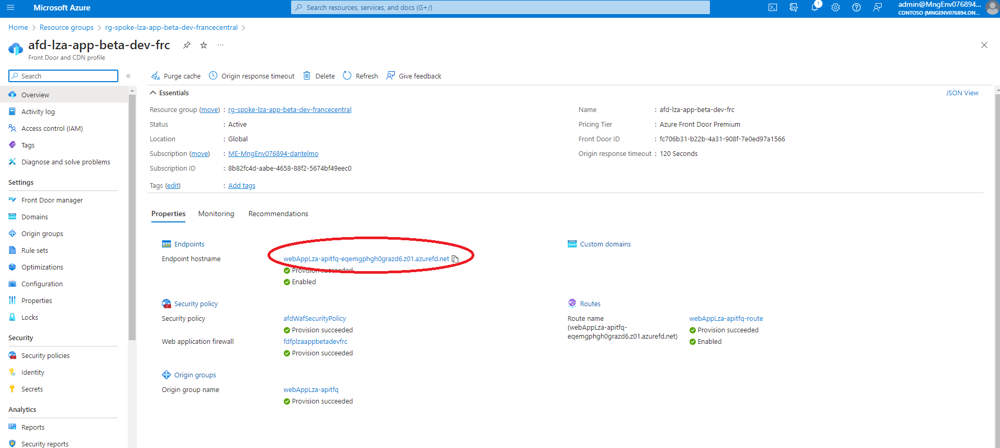

# Chat With You Data with Java and Azure Open AI - LZA App Accelerator
This is a PoC about automating apps deployment on production ready environment provided by [Azure Landing Zones](https://learn.microsoft.com/en-us/azure/cloud-adoption-framework/scenarios/app-platform/ready).

In this example we are going to deploy the [Azure Open AI Java reference template](https://learn.microsoft.com/en-us/azure/developer/intro/azure-ai-for-developers?pivots=java#azure-ai-reference-templates) on top of the [App Service LZA](https://github.com/Azure/appservice-landing-zone-accelerator) using the [Azure Developer CLI](https://learn.microsoft.com/en-us/azure/developer/azure-developer-cli/overview)

## Getting Started

### Deploy the infrastructure
1. Clone this repo. `git clone https://github.com/dantelmomsft/chat-with-your-data-java-lza-app-accelerator.git`
2. Run `cd chat-with-your-data-java-lza-app-accelerator/infra/app-service` 
3. Run `azd auth login` to authenticate with your Azure subscription.
4. Run `azd provision` to provision the infrastructure. Provide an env name and the deployment region. So far it has been tested with France central. This will take several minutes and will:
    - Download the app service lza code in  the folder `infra/app-service/bicep/lza-libs`.
    - Automatically run the app service lza code.
    - Automatically run the app bicep source code in the folder `chat-with-your-data-java-lza-app-accelerator\infra\app-service\bicep\modules`. This will create the Azure supporting services (Azure AI Search, Azure Document Intelligence, Azure Storage) required by the app on top of the App Service LZA infrastructure.
    -  Automatically create `.azure` folder with azd env configuration. you should see a folder like this: `chat-with-your-data-java-lza-app-accelerator\infra\app-service\.azure`
### Deploy the Java app 
1. Connect to the jumpbox, open a command prompt and run `git clone https://github.com/dantelmomsft/chat-with-your-data-java-lza-app-accelerator.git`
2. Run `cd chat-with-your-data-java-lza-app-accelerator` 
3. To download the the chat-with-your-data-java [source code ](https://github.com/Azure-Samples/azure-search-openai-demo-java) run:
    - *Windows Power Shell* - `.\scripts\download-app-source.ps1 -branch main` 
    - *Linux/Windows WSL* - `./scripts/download-app-source.sh --branch main`.
4. Run `cd chat-with-your-data-java-lza-app-accelerator/infra/app-service` and copy here the `chat-with-your-data-java-lza-app-accelerator\infra\app-service\.azure` local folder that has been created on your laptop at the end of [Deploy Infrastructure](#deploy-the-infrastructure)  phase.
5. Run `azd auth login`
6. Run `azd restore`. This is required for this code sample to ingest documents into the Azure AI search index. It will take a couple of minutes.
7. run `azd deploy`. This will build and deploy the java app.
8. From your local browser connect to the azure front door endpoint hostname. 

### Known Issues and gaps
- The jump box installation doesn't properly configure azd and maven. To fix that before running the `azd deploy` command, be sure to
    - Run the `D:\azd\azd-windows-amd64.msi` installer
    - Add to the PATH env variable the maven bin folder: `C:\Program Files\apache-maven-3.9.5\bin`

